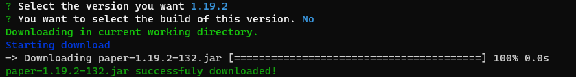

# PaperMC Downloads Api


*This library allows you to obtain version information of PaperMC projects and also generate download links.*

**Table of Contents:**

- [Quickstart](#quickstart)
- [Documentation](#documentation)
- [CLI](#cli)
    - [Commands](#commands)
- [Contributing](#contributing)

## Quickstart

Installing the client librery
```
npm install papermc-api
```

## Documentation

**PaperAPI.projects()**

List all PaperMC projects.
```ts
let projects = await PaperAPI.projects(); // Returns array with all PaperMc projects.
```

**PaperAPI.project(project_id)**

Get the information of a PaperMC project.
`project_id`: must be *waterfall*/*velocity*/*paper*.
```ts
let project = await PaperAPI.project("waterfall"); // Returns project info
```

**PaperAPI.project(project_id).getVersion(version)**

Get a version of a PaperMC project.

`version`: Must be a Minecraft Version. *Example: 1.19.2*
```ts
let project = await PaperAPI.project("waterfall"); // Returns project info

let version = await project.getVersion("1.19.2"); // Returns version info
```

**PaperAPI.project(project_id).getVersion(version).getBuild(build_number)**

Get the build information of a version of the PaperMC project

`build_number`: Must be a valid build number or latest. *Example: 568 or latest*
```ts
let project = await PaperAPI.project("waterfall"); // Returns project info

let version = await project.getVersion("1.19.2"); // Returns version info

let build = await version.getBuild("latest"); // Returns Build info
```

**PaperAPI.project(project_id).getVersion(version).getBuild(build_number).getDownloadUrl(download)**

Generates a link to download the specified file.

`download` *optional*: Specifies the file from which you want the link, in case you do not specify this parameter, the file will be downloaded *applicaiton*.

```ts
let project = await PaperAPI.project("waterfall"); // Returns project info

let version = await project.getVersion("1.19.2"); // Returns version info

let build = await version.getBuild("latest"); // Returns Build info

let downloadUrl = build.getDownloadUrl(); // Returns download URL for in this case waterfall 1.19.2
```

## CLI

Using papermc API from terminal.
```
npm install -g papermc-api
```

### Commands

**projects** : List all PaperMC projects.

**project <project_id> [version] [build]** : Show information of PaperMC project.

`project_id`: Must be an valid project id. *Example: paper*

`version` *(optional)*: Must be an valid Minecraft Version. *Example: 1.18*

`build` *(optional)*: Must be an valid build id of this project version. *Example: 131*

**download <project>** : Downloads application jar of a PaperMC Project.

__**Options**__

**-P, --path <path>** : This option sets the path where the download will be executed.

This command can be executed in two ways.

**Frist Way**: *Only project id*

You can just provide the project ID and the CLI will prompt you for the rest of the information.

*Example:*



**Second Way**: *Providing the project ID and version*

If you write the project ID in this format <project_id>@<version>-[build] (build its optional) the application jar will be downloaded automatically in the working directory.

*Example:*

This command will download the latest build of version 1.19.2 of paper.
```
papercli download paper@1.19.2
```

## Contributing

To contribute this is the [repository](https://github.com/VeguiDev/papermc-api) of this package.